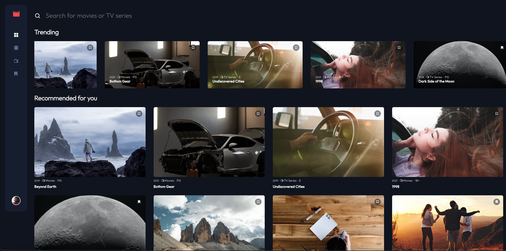

# Frontend Mentor - Entertainment web app solution

This is a solution to the [Entertainment web app challenge on Frontend Mentor](https://www.frontendmentor.io/challenges/entertainment-web-app-J-UhgAW1X). Frontend Mentor challenges help you improve your coding skills by building realistic project.

## Table of contents

- [Overview](#overview)
  - [The challenge](#the-challenge)
  - [Screenshot](#screenshot)
  - [Links](#links)
- [My process](#my-process)
  - [Built with](#built-with)
  - [What I learned](#what-i-learned)
  - [Continued development](#continued-development)
- [Author](#author)

**Note: Delete this note and update the table of contents based on what sections you keep.**

## Overview

### The challenge

Users should be able to:

- View the optimal layout for the app depending on their device's screen size
- See hover states for all interactive elements on the page
- Navigate between Home, Movies, TV Series, and Bookmarked Shows pages
- Add/Remove bookmarks from all movies and TV series
- Search for relevant shows on all pages
- **StillWorking**: Build this project as a full-stack application
- **StillWorking**: If you're building a full-stack app, we provide authentication screen (sign-up/login) designs if you'd like to create an auth flow

### Screenshot



### Links

- Solution URL: [https://github.com/Kulya1986/fm_project9_web_entertainment](https://github.com/Kulya1986/fm_project9_web_entertainment)
- Live Site URL: [https://adorable-pegasus-f804e3.netlify.app/](https://adorable-pegasus-f804e3.netlify.app/)

## My process

### Built with

- Semantic HTML5 markup
- Flexbox
- CSS Grid
- Sass
- [React](https://reactjs.org/) - JS library
- [React Router](https://reactrouter.com/) - React routing library

### What I learned

Working on the project I've mastered my knowledge of React Router to handle natural browser experience for users. Also improved skills in creating and managing states with Context Providers.

A new experience was to use variables for setting up animation props in CSS:

```css
@keyframes carousel {
  to {
    transform: translateX(var(--translateEnd));
  }
}
```

```jsx
<div
          id="trending-list-holder"
          style={
            translateEnd
              ? {
                  "--translateEnd": translateEnd,
                  animation:
                    "carousel 40s ease-in-out 1s infinite alternate forwards",
                }
              : null
          }
        >
```

### Continued development

Further working on this project to set it up as a Full-Stack App with server-side. And shortly will add functionality for creating account and saving user's preferences.

## Author

- Website - [Nataliia Kuyk](https://portfolio-page-sthy.onrender.com/)
- Frontend Mentor - [@Kulya1986](https://www.frontendmentor.io/profile/Kulya1986)
